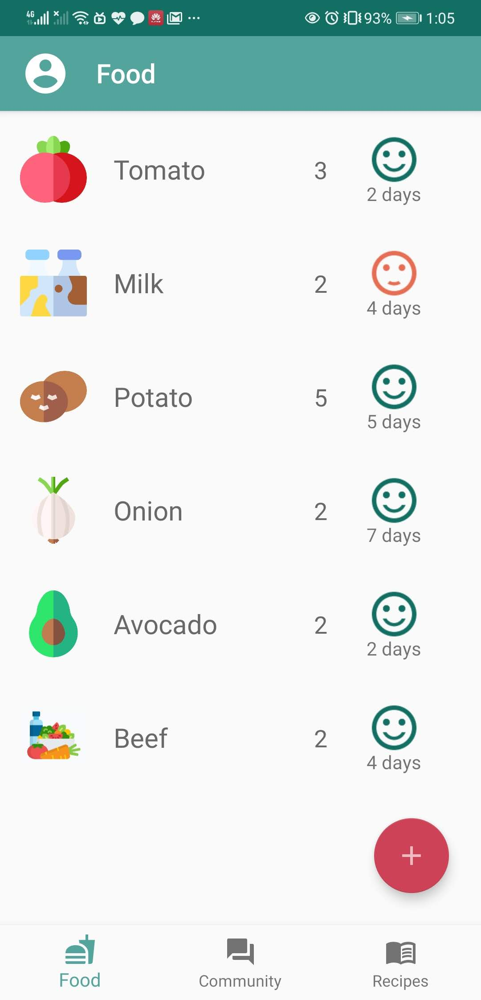
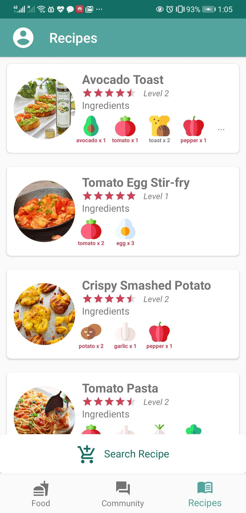
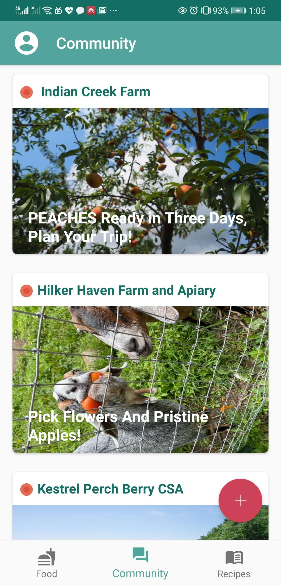
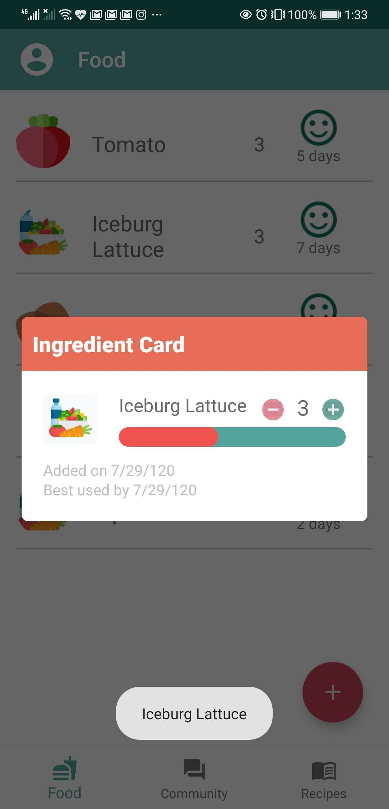
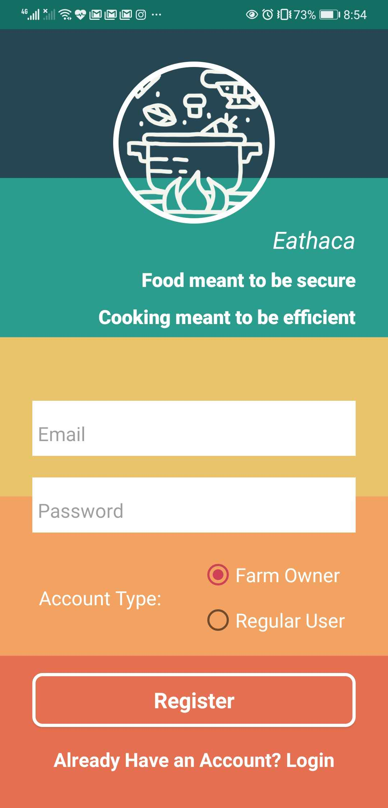

# Eathaca 
## App Ideology 
Many Cornell students start to cook on their own in order to maintain health during the quarantine period.  Managing raw ingredients with different freshness and amount and making diverse cuisines becomes a challenge for students new to cooking or have a fast-paced lifestyle. 
Meanwhile, many local farms also experience financial difficulties resulting from COVID-19, which severely limited their sales.
Therefore, we aim to develop an Android app that helps students efficiently turn groceries into healthy and safe food and protect small local farms from bankruptcy due to COVID-19. 
In our app, we would like to keep track of the freshness of the food, provide customized recipes that give a straightforward demonstration of old and new ingredients needed, and construct a platform for local farms to advertise their new seasonal products. 
## App Screenshots

